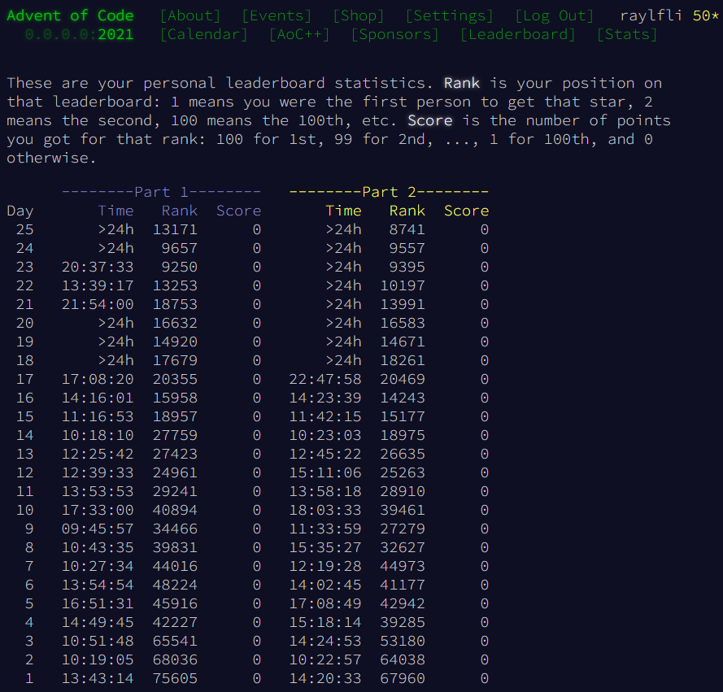

# Advent of Code 2021

Another year of Advent of Code! While my finisher number is not as low as last year, my main goal this year was to learn the basics of Scala.

For the full Advent of Code event page, click [here](https://adventofcode.com/2021).

A few of the days were quite tricky, notably Days 19, 23, and 24. I tried to finish all the puzzles on the day they were released, but other priorities hindered that.

Most of the days were completed without looking at any solutions, but for a very small selection of them, solutions from the Advent of Code [subreddit](https://www.reddit.com/r/adventofcode/) were glanced at to inspire solutions and optimization methods.

## Personal Statistics

