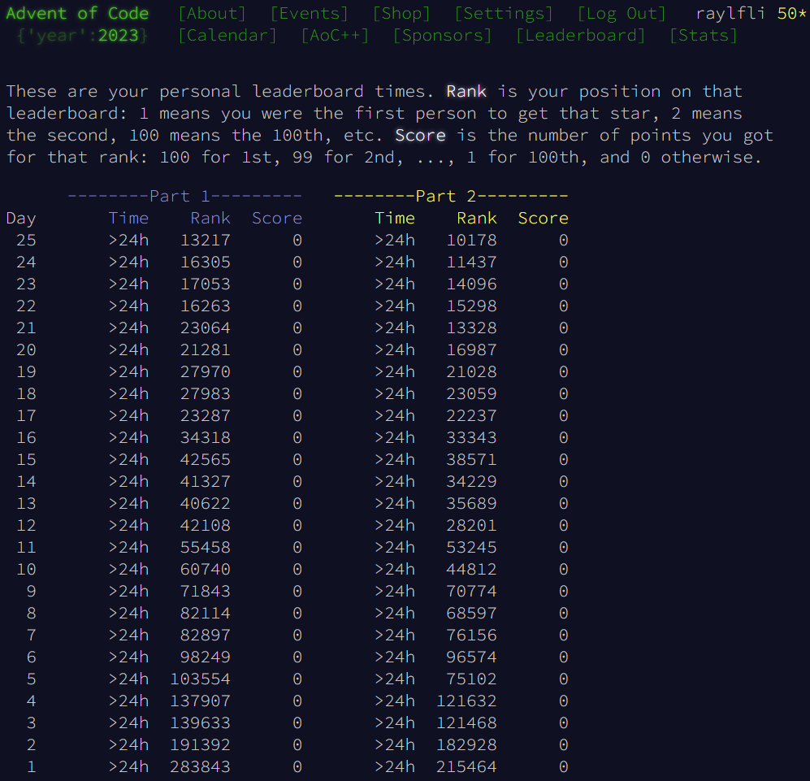

# Advent of Code 2023

Another December, another Advent of Code! I wasn't able to start it on time this year, but I still wanted to take some time and learn Rust.

For the full Advent of Code event page, click [here](https://adventofcode.com/2023).

Generally, I found this year easier than 2021. There were some tricky days where formulating a tractable problem was difficult, most puzzles went well.

Most of the days were completed without looking at any solutions, but for a very small selection of them, solutions from the Advent of Code [subreddit](https://www.reddit.com/r/adventofcode/) were used as inspiration for problem representation and algorithm optimization.

## Personal Statistics

