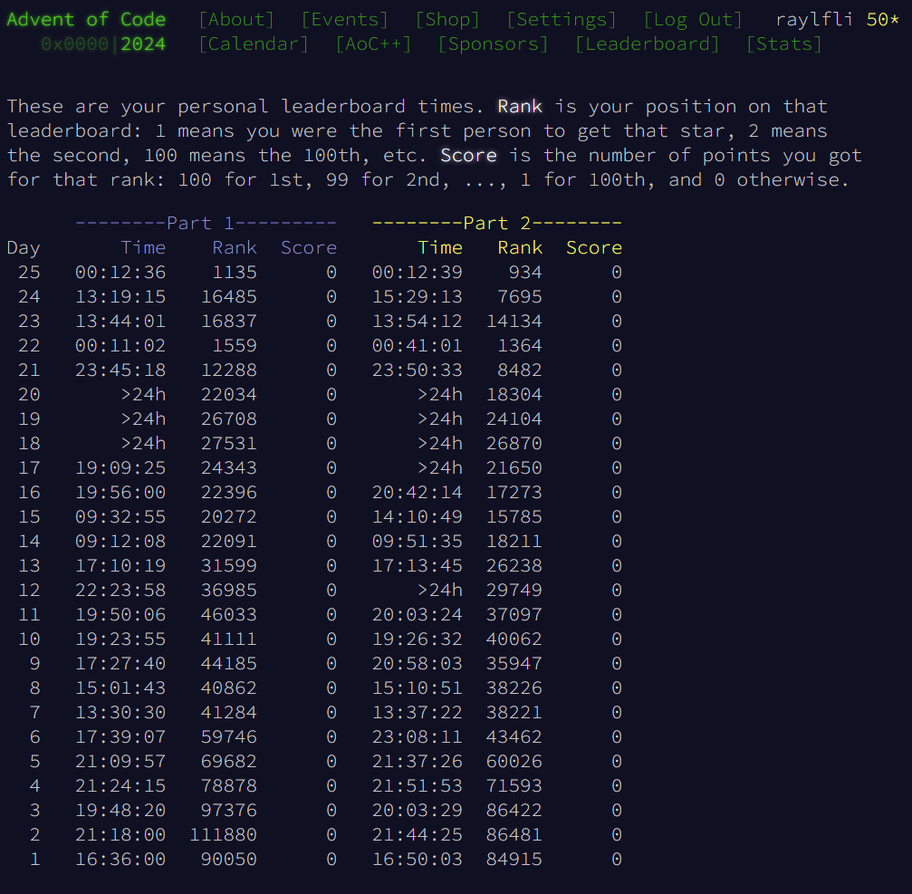

# Advent of Code 2024

10th anniversary of Advent of Code complete! I decided to do it in Python this year due to time constraints I had.

For the full Advent of Code event page, click [here](https://adventofcode.com/2024).

Generally, I found this year easier than all the previous ones I've done. There were a couple tricky puzzles that I had to glance at the [subreddit](https://www.reddit.com/r/adventofcode/) for, but this year felt significantly better than most!

## Personal Statistics

